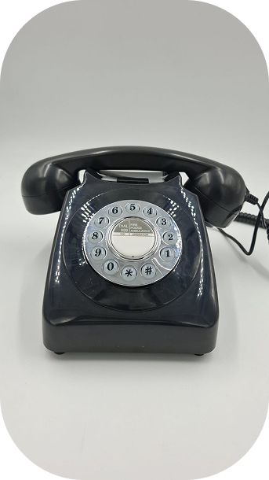
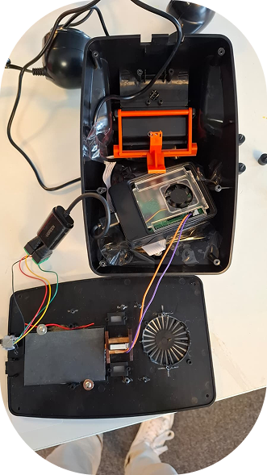
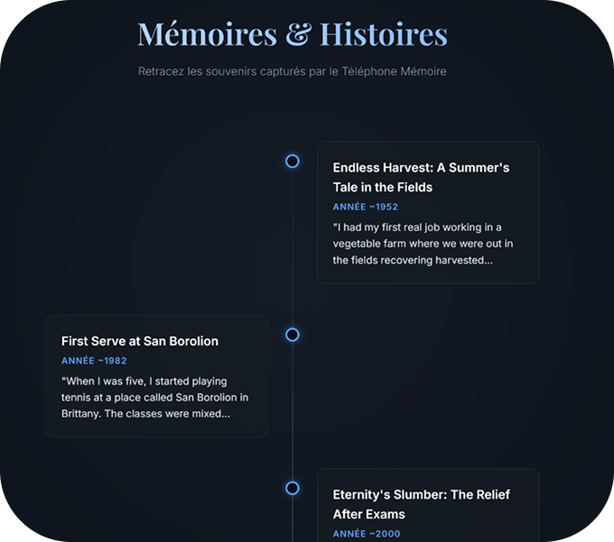

# Loom Collection - The Teller

[](./software/server/requirements.txt)
[](./docs/architecture-diagram.md)
[](./docs/user-journey.md)

## Project Description

**Embodied AI Voice Assistants for Older Adults**

Loom Collection is a family of AI voice assistants embedded in vintage everyday objects and designed to support older adults through familiar, tangible interactions. The project explores how embodied conversational AI can create warmer and more accessible experiences than screen-based systems. 

**The Teller** is the flagship prototype: a GPO 746 vintage telephone containing a Raspberry Pi 5 that supports voice-based memory-sharing conversations with an AI. Each conversation is transcribed, turned into a story, and stored in a chronological web timeline that can later be accessed by family members.

### Ecosystem
- **The Teller**: Prototyped vintage telephone for voice-based memory collection and storytelling.
- **The Tuner**: Concept vintage radio focused on news access, companionship, and cognitive stimulation.
- **The Imprint**: Concept vintage typewriter that turns memories into printed and illustrated stories.

## How It Works
1. **Pick up handset**: lifting the phone handset starts a voice session automatically.
2. **AI asks about life memories**: the assistant opens the conversation and progressively explores anecdotes from the user's life.
3. **Stories are transcribed and summarized**: speech is processed locally into text and narrative story form.
4. **Family accesses the timeline**: stories appear in a chronological web interface that can be viewed from another device.

## Technical Architecture
The system follows a privacy-first local client-server architecture. On the client side, a **Raspberry Pi 5** embedded inside the vintage phone detects the hook switch, captures handset audio, and communicates with the server over a persistent **WebSocket** connection. On the server side, the project uses **Faster-Whisper** for speech-to-text, **Ollama** for local LLM inference, **Kokoro** for text-to-speech, and a lightweight local web application/API layer backed by **SQLite** for storage and timeline access. In the current repository, the web layer is implemented with FastAPI while fulfilling the same local web-app role described in the defense architecture.

## Demo (Photos, Videos & Audio)

### 1. Prototype: "The Teller"

*Figure 1: The physical interface in use, providing an accessible and familiar tangible experience for older adults.*


*Figure 2: The classic GPO 746 vintage telephone, serving as the interactive hub of the Loom project.*

### 2. Internal Components (Hardware Setup)

*Figure 3: Inside of the prototype showing the embedded Raspberry Pi 5 with its active cooler, wired to the hook switch and audio interfaces.*


*Figure 4: The original donor hardware box (GPO 746 Push Button Phone).*

### 3. Software UI

*Figure 5: "Mémoires & Histoires" - The chronological web timeline where family members can read and trace the captured memory stories.*

### 4. Audio & Video Details
- **▶️ System Execution Logs**: Watch a video showing the backend log activity while the project runs [here](./videos/system_logs.mp4).
- **🔊 AI Conversation Sample**: Listen to a recorded excerpt of a discussion with the autonomous AI [here](./videos/ai_conversation.mp3).

## How to Replicate

### 1. Software & Firmware
The project utilizes a local client-server architecture where the physical phone (Raspberry Pi) acts as the physical interface (firmware) communicating over websockets with a PC-based local AI server.

**Source Code and Instructions**:
- **Server (Software)**: See the `/software/server` directory for Local LLM inference, TTS, STT, and the Web UI.
- **Client (Firmware)**: See the `/software/client` directory for audio capture and Raspberry Pi hardware interactions.

**Quick Start**:
1. Server: 
   ```bash
   cd software/server
   pip install -r requirements.txt
   PYTHONPATH=.. python server.py
   ```
2. Client (Raspberry Pi): 
   ```bash
   cd software/client
   pip install -r requirements.txt
   python client_pi.py --server ws://<SERVER_IP>:8000/ws
   ```

### 2. Hardware
The physical shell is based on an existing GPO 746 vintage telephone.

- **Bill of Materials (BOM)**: Detailed list available in [`hardware/BOM.md`](./hardware/BOM.md).
- **Assembly Instructions**: View the step-by-step guide in [`hardware/assembly-instructions.md`](./hardware/assembly-instructions.md).
- **Fabrication Files**: Existing hardware is used; no custom 3D printed models are necessary. 

### 3. Electronics
- **Electronic Components**: Included inside the hardware BOM.
- **Wiring Diagrams & Schematics**: A complete diagram and instructions are available in [`hardware/electronics/wiring-diagram.md`](./hardware/electronics/wiring-diagram.md) and [`hardware/electronics/schematics/wiring-diagram.png`](./hardware/electronics/schematics/wiring-diagram.png).

## Repository Structure

```text
Loom/
├── README.md
├── LICENSE
├── images/           <-- Photos/Screenshots of the demo
├── videos/           <-- Videos and Audio samples
├── docs/             <-- Architecture and UX documentation
├── hardware/         <-- BOM, assembly steps, electronics schematics
├── software/         <-- Client (firmware) & Server (software) source code
└── .gitignore
```

## Authors
**Alexandre LE PORT** & **Alexandre HAGUET**  
ESILV Creative Technology Master, 2025-2026

## References
- Pradhan et al. (2020)
- Huang et al. (2025, CHI)
- Zhai et al. (2024, ASSETS)
- Ghajargar et al. (2022)
